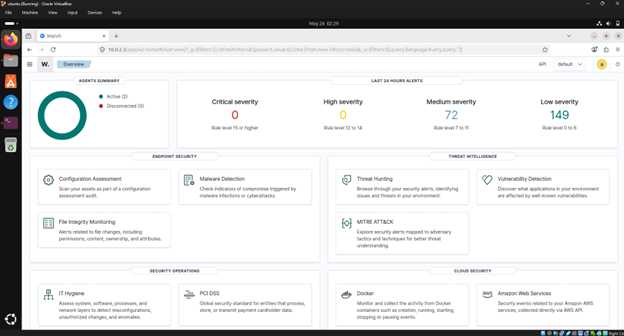
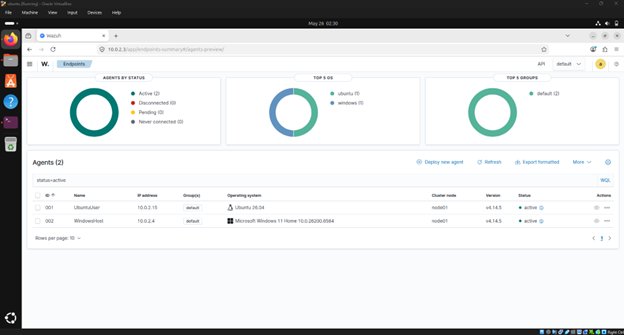
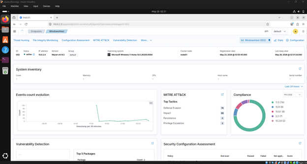
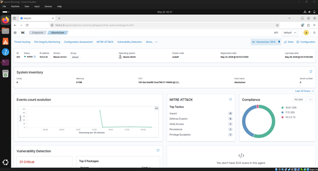

# Wazuh Home SIEM Lab

## Overview

This project involved building a home SIEM lab using Wazuh, Ubuntu Linux, Windows 11, and Oracle VirtualBox. The environment was designed to simulate enterprise security monitoring by centralizing logs and monitoring endpoint activity across Linux and Windows systems.

---

## Architecture

Wazuh Manager (Ubuntu VM)
       ↑
 ┌─────┴─────┐
 │           │
Ubuntu VM   Windows 11 VM

---

## Technologies Used

- Wazuh
- Ubuntu Linux
- Windows 11
- Oracle VirtualBox
- Wazuh Agents

---

## Features

- Centralized log monitoring
- Linux endpoint monitoring
- Windows endpoint monitoring
- Security event visibility
- Endpoint log collection

---

## Skills Demonstrated

- SIEM deployment
- Log analysis
- Endpoint monitoring
- Linux administration
- Windows monitoring
- Security operations workflows

---

## Future Improvements

- Add Sysmon integration
- Configure custom detection rules
- Simulate attack scenarios
- Add threat intelligence feeds

---

## Screenshots

### Wazuh Dashboard

### Active Agents

### Endpoints

